  
   
  <h3>A Passionate Developer from Vietnam 🇻🇳</h3>
  
    
  

---

### 🚀 About Me
- 🌱 **Currently Learning**: AI, Python, Deep Learning, and more!
- 📫 **Reach Me**: [admin@fptoj.com](mailto:admin@fptoj.com)
- 💡 **Fun Fact**: I love blending creativity with code to build exciting projects!

---

  <h3>🌐 Connect with Me</h3>
  

---

### 🌟 My GitHub Stats

  <!-- Gọi ảnh nội bộ do GitHub Actions tạo ra -->
  
  
    
  <!-- Thẻ Streak vẫn chạy tốt trên server Heroku nên giữ nguyên -->
  

---

  <b>✨ Let's code the future together! ✨</b>

