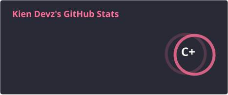
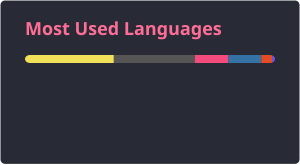
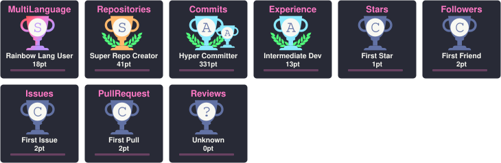

# Ha Tri Kien

I am a software developer exploring the practical side of Artificial Intelligence and deep learning. I build applications using C# C++ Java and Python. I spend my time writing code and turning complex technical ideas into reliable systems.

[Email](mailto:hatrikien@acmc.vn) • [LinkedIn](https://www.linkedin.com/in/hà-trí-kiên-319534355/)

 

  
  

 

  

 

  

